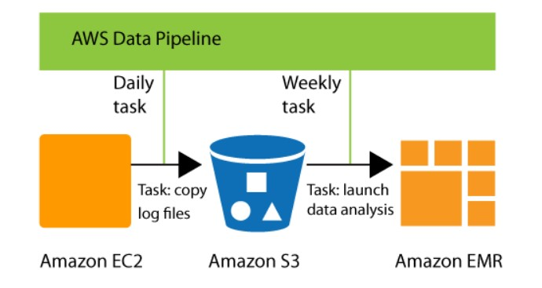
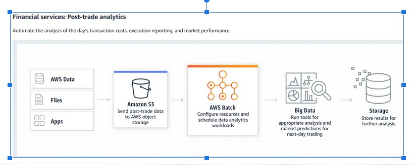

Recently i passed AWS Machine Learning Speciality exam with score 950/1000. Below, i am putting all my notes, resources and how did i approached the exam.

Exam questions are divided in to four sections. Data Engineering, Data Exploration, Modeling and Model Deployment.

## Resources

1. This is the official [exam guide](<https://d1.awsstatic.com/training-and-certification/docs-ml/AWS%20Certified%20Machine%20Learning%20-%20Specialty_Exam%20Guide%20(1).pdf>) read it carefully to understand the exam pattern.
2. Exam [Sample Questions](https://d1.awsstatic.com/training-and-certification/docs-ml/AWS-Certified-Machine-Learning-Specialty_Sample-Questions.pdf)
3. Udemy ML Specialty Preparation [Course](https://www.udemy.com/course/aws-machine-learning/). I found it really helpful to understand the overall expectations and a good starting points for exam material.
4. Udemy ML Specialty [Practice exam](Udemy ML Specialty Practice exam) Do this practice test after first round of prepration. If you in first do not worry, you will pass with confidence in third round.
5. Whizlab practice [exams](https://www.whizlabs.com/aws-certified-machine-learning-specialty/)
6. [AWS blog](https://aws.amazon.com/blogs/?awsf.blog-master-category=category%23artificial-intelligence), read this blogs to understand the different concepts used in different use case scenarios.
7. SageMaker [Developer Guide](https://docs.aws.amazon.com/sagemaker/latest/dg/whatis.html). Go through the documentation of different algorithms and other concepts. Use this for reference.
8. Examtopics [sample questions](https://www.examtopics.com/exams/amazon/aws-certified-machine-learning-specialty/). These questions have some previous AWS exam question that were also in my exam. DO NOT SKIP THESE QUESTIONS. Practice at least once before the exam. Though they do not have correct answers, you need to read the discussion and use your knowledge to understand to choose the right answers.

## Approach

I prepared the exam in three stages.

1. Stage 1:
   1. I went through the Udemy course once and did all the labs.
   2. I took notes and prepare content from course slides. They covered the important concept and slides is a good resource for quick review of concepts
   3. Read SageMaker documents, AWS services hoepages and internet resources, if you did not understand some concepts.
   4. Attemped the Full test from the the same course providers and i failed.
   5. Checked the concepts where i was lagging or made mistake and read more about these concepts and took notes.
2. Stage 2
   1. Visited relevant AWS Services and read about the use cases or examples and took notes
   2. Attempted the Whizlab full test one
   3. Read through the explanation of every question even for those where i was correct. These explainations have link for the concepts that i read to have more understanding.
   4. Attempted the Whizlab full test two and did the same as previous step.
   5. At this stage i was quite confident about different concepts. I took alot of notes that i have put in later section
3. Stage 3
   1. In the last week before my exam, I took one week to read AWS ML blogs, other online resources to have clear understanding of different concepts and which service is better in which scenario.
   2. Attempted again all three full tests and found the concepts where i need to read more
   3. At the end i went through these samples [questions](https://www.examtopics.com/exams/amazon/aws-certified-machine-learning-specialty/). These are some real AWS exam questions
   4. Now after all this i was feeling very confident.

## Tips

1. Read Question and options very carefully. Try to read question two times. Since this exam duration is 3 hours, you will have sufficinet time for each question.
2. Check the objective of the question. Is there something that need to be optimized, like cost, time etc.
3. Most of the time, you can discard two options and then answer you can decide by what need to be optimized.
4. Flag, question that you have doubt, come later and check these questions again. Sometimes another question has answer/hint for flagged question.
5. Keep calm, you have enough time

# Notes

## Data Engineering(20%)

Below are the expected concepts that are covered under this section

1. Storage Topics
   - S3 Data Lakes
   - Dynamo DB
2. Data transformation
   - Glue
   - Glue ETL
   - Lambda Function
3. Streaming
   - Kinesis
   - Kinesis Video Streams
4. Workflow
   - Data Pipeline
   - AWS Batch
   - Step Functions

### AWS Storage Gateway

- AWS Storage Gateway is a hybrid cloud storage service that gives you on-premises access to virtually unlimited cloud storage.
- Customers use Storage Gateway to simplify storage management and reduce costs for key hybrid cloud storage use cases.
- These include moving tape backups to the cloud, reducing on-premises storage with cloud-backed file shares, providing low latency access to data in AWS for on-premises applications, as well as various migration, archiving, processing, and disaster recovery use cases.

### Security

#### VPC

- An endpoint is a network component that connects EC2 instances in a VPC to certain AWS services without requiring public IP addresses.(keep traffic within the AWS network)
- With a VPC endpoint, instances don't need a NAT device, VPN connection, internet gateway
- Two types of VPC Endpoints
  - Interface Endpoint
    - allows a private IP address in a subnet to connect VPC resources to a number of AWS services (ex Sagemaker)
    - Traffic from VPC resources to --> endpoint network interface,AWS PrivateLink then enables the endpoint to connect the → traffic to other services without going over the internet.
  - Gateway Endpoint
    - a target for a route in a route table to connect VPC resources to S3 or DynamoDB.
    - Traffic is then routed from instances in a subnet to one of these two services.
    - Gateway endpoints do not use PrivateLink
- **Subnet**
  - A subnet, or subnetwork, is a segmented piece of a larger network or VPC here
  - If a subnet's traffic is routed to an internet gateway, the subnet is known as a public subnet.
  - If a subnet doesn't have a route to the internet gateway, the subnet is known as a private subnet.

### Kinesis Data Stream

- low latency streaming ingest at scale
- Streams divided into shards
  - Each shard has a sequence of data records.
  - Data records are composed of a sequence number, a partition key, and a data blob
  - A partition key is used to group data by shard within a stream
  - Sequence number is unique per partition-key within its shard
  - The longer the time period between write requests, the larger the sequence numbers become
  - Record can be upto 1 MB
- Data Retention is 24 hours by default and can go upto 7 days
- Multiple apps can consume same data
- These consumers are known as Amazon Kinesis Data Streams Application.
- Once data is inserted in Kinesis it cant be deleted
- Kinesis Client Library (KCL)
  - It is compiled into your application to enable fault-tolerant consumption of data from the stream
- Two types of consumers: shared fan-out and enhanced fan-out consumers.
- Monitor the stream service with CloudWatch
- **PutRecord**:
  - Write a single data record into an Amazon Kinesis data stream.
  - Call PutRecord to send data into the stream for real-time ingestion and subsequent processing, one record at a time

#### **Scenarios for using Kinesis Data Streams:**

- Accelerated log and data feed intake and processing
- Real-time metrics and reporting
- Real-time data analytics
- Complex stream processing
  - This typically involves putting data from multiple Kinesis Data Streams applications into another stream for downstream processing by a different Kinesis Data Streams application.

#### **Benefits of Using Kinesis Data Streams**

- A common use is the real-time aggregation of data followed by loading the aggregate data into a data warehouse or map-reduce cluster.
- The delay between the time a record is put into the stream and the time it can be retrieved (put-to-get delay) is typically less than 1 second
- **Its fully managed and that makes it very flexible for increasing and decreasing data stream capacity**

#### Security in Kinesis Data Stream

**Server-side encryption**

- It automatically encrypts data before it's at rest by using an AWS KMS customer master key (CMK) you specify.
- Data is encrypted before it's written to the Kinesis stream storage layer, and decrypted after it’s retrieved from storage

### Kinesis Data Analytics:

- perform real time analytics on streaming using SQL
  Amazon Kinesis Data Analytics provides built-in functions to filter, aggregate, and transform streaming data for advanced analytics with SQL or Flink
- 2 ML services that works inside/along with it
  - Random_cut_forest
    - Anomaly detection
  - HOTSPOT
    - Locate and return dense region of the data
- create a Kinesis data analytics application that continuously reads and processes streaming data
- The service supports ingesting data from Amazon Kinesis Data Streams and Amazon Kinesis Data Firehose streaming sources.

- Amazon Kinesis Data Analytics needs permissions to read records from a streaming source and write application output to the external destinations. You use IAM roles to grant these permissions.
- Kinesis Data Analytics automatically provides an in-application error stream for each application.
- Amazon Kinesis Data Analytics ensures that your application output records are written to the configured destination. It uses an "at least once" processing and delivery model

### Kinesis Firehose:

- It can capture, transform, and load streaming data in to S3, Readshift, ElasticSearch & Splunk
  - Amazon Kinesis Data Firehose CAN CONVERT THE FORMAT OF YOUR input data from JSON to Apache Parquet or Apache ORC before storing the data in Amazon S3.
  - If you want to convert an input format OTHER THAN JSON, SUCH AS CSV or structured text, you can use AWS Lambda to transform it to JSON first.
- Fully managed
- It can also batch, compress, transform, and encrypt the data before loading it, minimizing the amount of storage
- You can also configure your delivery stream to automatically convert the incoming data to columnar formats like Apache Parquet and Apache ORC, before the data is delivered to Amazon S3, for cost-effective storage and analytics.
- **Data Injection not streaming**
- **Near Real Time**
- If record format conversion is enabled, Kinesis Data Firehose can deliver data to Amazon S3 only.

- Kinesis Data Firehose delivery stream
- Use Kinesis Data Firehose by creating a Kinesis Data Firehose delivery stream and then sending data to it
- Kinesis Data Firehose buffers incoming streaming data to a certain size or for a certain period of time before delivering it to destinations. Buffer Size is in MBs and Buffer Interval is in seconds.
- For Amazon Redshift destinations, streaming data is delivered to your S3 bucket first. Kinesis Data Firehose then issues an Amazon Redshift COPY command to load data from your S3 bucket to your Amazon Redshift cluster.
- Record: The data of interest that your data producer sends to a Kinesis Data Firehose delivery stream. A record can be as large as 1,000 KB
- Use the following access policy to enable Kinesis Data Firehose to access your S3 bucket and AWS KMS key. **If you don't own the S3 bucket, add s3:PutObjectAcl to the list of Amazon S3 actions**, which grants the bucket owner full access to the objects delivered by Kinesis Data Firehose
- Kinesis Data Firehose can invoke your Lambda function to transform incoming source data and deliver the transformed data to destinations
- The buffer interval hints range from **60 seconds to 900 seconds**

### GLUE

- AWS Glue is serverless. Uses other AWS services to **orchestrate your ETL jobs** to build a data warehouse. It is designed to work with **semi-structured** data.
- It introduces a component called a **dynamic frame**, which you can use in your ETL scripts. A dynamic frame is similar to an Apache Spark dataframe, except that each record is self-describing, so no schema is required initially.

- Serverless ETL jobs run in Isolation
  - During provisioning of an ETL job, you provide input data sources and output data targets in your virtual private cloud (VPC).
  - In addition, you provide the IAM role, VPC ID, subnet ID, and security group that are needed to access data sources and targets.
  - For each tuple (customer account ID, IAM role, subnet ID, and security group), AWS Glue creates a new Spark environment that is isolated at the network and management level from all other Spark environments inside the AWS Glue service account.
- Glue has crawlers and classifiers that it use to find the schema of a data source.
- Classifiers
  - Determines the schema of data use classifiers when you crawl a data store to define metadata tables in the AWS Glue Data Catalog.
  - AWS Glue provides classifiers for common file types, such as CSV, JSON, AVRO, XML, and others
  - It also provides classifiers for common relational database management systems using a JDBC connection.
  - You can write your own classifier by using a grok pattern or by specifying a row tag in an XML document.
- Crawlers
  - A program that connects to a data store (source or target), progresses through a prioritized list of classifiers to determine the schema for your data, and then creates metadata tables in the AWS Glue Data Catalog
  - Crawlers can crawl both file-based and table-based data stores.

**What happens when a crawler runs?**

- Classifies data to determine the format, schema, and associated properties of the raw data
  - You can configure the results of classification by creating a custom classifier.
- Groups data into tables or partitions
- Write Metadata to the data catalog
  - You can configure how the crawler adds, updates, and deletes tables and partitions.
  - When the majority of schemas at a folder level are similar, the crawler creates partitions of a table instead of two separate tables.
  - To influence the crawler to create separate tables, add each table's root folder as a separate data store when you define the crawler.

**How Does a Crawler Determine When to Create Partitions?**

When an AWS Glue crawler scans Amazon S3 and detects multiple folders in a bucket, it determines the root of a table in the folder structure and which folders are partitions of a table

**How classifiers in a crawler work?**

- A classifier reads the data in a data store. If it recognizes the format of the data, it generates a schema with a certentity number to indicate how certain the format recognition was.
- AWS Glue invokes custom classifiers first, in the order that you specify in your crawler definition. Depending on the results that are returned from custom classifiers, AWS Glue might also invoke built-in classifiers.
- If a classifier returns certainty=1.0 during processing, AWS Glue then uses the output of that classifier.
- If no classifier returns certainty=1.0, AWS Glue uses the output of the classifier that has the highest certainty.
- If no classifier returns a certainty greater than 0.0, AWS Glue returns the default classification string of UNKNOWN.
- If you change a classifier definition, any data that was previously crawled using the classifier is not reclassified.

#### Glue ETL

- AWS Glue can generate a script to transform your data. Or, you can provide the script in the AWS Glue console or API
  - Generate code in different language Python, Pyspark
- Bundled Transformation: DropFields, DropNullFienls, filter join and map
- Nothing to worry about Spark cluster, because it is fully managed
- Transformation
  - ML transformation:
    1. FindMatchML: identify duplicate or matching records in dataset, even they do not match exactly
    2. Each FindMatches transform must be taught what should be considered a match and what should not be considered a match. You teach your transform by adding labels to a file and uploading your choices to AWS Glue.
    3. Each FindMatches transform contains an accuracy-cost parameter. You can use this parameter to specify one of the following:
       - If you are more concerned with the transform accurately reporting that two records match, then you should emphasize accuracy
       - If you are more concerned about the cost or speed of running the transform, then you should emphasize lower cost.
       - The labelling file must be encoded as UTF-8 without BOM(byte order mask)
       - Labelling file in CSV format

#### When Should i use GLUE?

1. Use AWS Glue to organize, cleanse, validate, and format data for storage in a data warehouse or data lake
   - Transform and move AWS Cloud data into your data store
   - Load data from disparate sources into your data warehouse or data lake for regular reporting and analysis
2. When you run serverless queries against your Amazon S3 data lake
   - AWS Glue can catalog your Amazon S3 data, making it available for querying with Amazon Athena and Amazon Redshift Spectrum.
   - With crawlers, your metadata stays in sync with the underlying data.
   - Access and analyze data through one unified interface without loading it into multiple data silos.
3. Create event-driven ETL pipelines with AWS Glue
   - Run your ETL jobs as soon as new data becomes available in Amazon S3 by invoking your AWS Glue ETL jobs from an AWS Lambda function.
   - Register this new dataset in the AWS Glue Data Catalog as part of your ETL jobs.
4. Use AWS Glue to understand your data assets
   - Store data using various AWS services and still maintain a unified view of your data using the AWS Glue Data Catalog
   - View the Data Catalog to quickly search and discover the datasets that you own, and maintain the relevant metadata in one central repository.

### Data Pipeline

- AWS Data Pipeline is a web service that you can use to automate the movement and transformation of data
- With AWS Data Pipeline, you can define data-driven workflows, so that tasks can be dependent on the successful completion of previous tasks
- Pipeline Definition: A pipeline definition is how you communicate your business logic to AWS Data Pipeline
  - From your pipeline definition, AWS Data Pipeline determines the tasks, schedules them, and assigns them to task runners.
  - If a task is not completed successfully, AWS Data Pipeline retries the task according to your instructions and, if necessary, reassigns it to another task runner.

#### Use case example

Use AWS Data Pipeline to archive your web server's logs to Amazon S3 each day and then run a weekly Amazon EMR (Amazon EMR) cluster over those logs to generate traffic reports. AWS Data Pipeline schedules the daily tasks to copy data and the weekly task to launch the Amazon EMR cluster. AWS Data Pipeline also ensures that Amazon EMR waits for the final day's data to be uploaded to Amazon S3 before it begins its analysis, even if there is an unforeseen delay in uploading the logs.

### AWS Batch

- AWS Batch enables developers, scientists, and engineers to easily and efficiently run hundreds of thousands of batch computing jobs on AWS
- Serverless
- Run batch as docker images
- Prefer non ETL jobs in batch
  - Configure resources and schedule data analytics
- For any computing job regardless of the job
- Using EC2 instances

### AWS Step Function

- To design each step of the execution, workflow.
- Build Distributed Applications Using Visual Workflows.
- AWS Step Functions makes it easy to coordinate the components of distributed applications and microservices using visual workflows.
- Use to design workflow
- Audit of history workflow
- Advanced error and try mechanism
- In batch job where we check success and failure

## Exploratory Data Analysis(24%)
